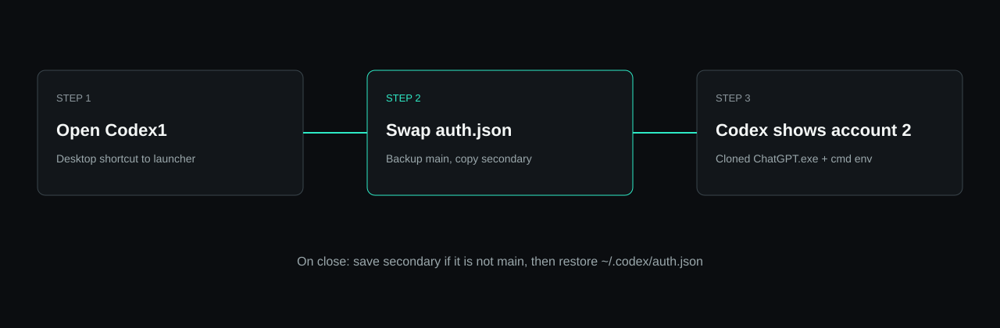

# Codex Multi-Profile

[](https://github.com/Hung2124/codex-multi-profile/actions/workflows/ci.yml)
[](https://github.com/Hung2124/codex-multi-profile/releases)
[](LICENSE)
[](#install)

Two ChatGPT logins on **Codex Desktop for Windows**. One shared workspace.

A second `CODEX_HOME` often fails: the app-server still reads `~\.codex\auth.json` and you land on the **main** account. This repo swaps the token the app actually reads (**AuthSwap**), then restores the main account when the profile window closes.

[Tiếng Việt](README.vi.md)


> Unofficial. Not affiliated with OpenAI. Requires Codex Desktop from the Microsoft Store.

## Why this exists

| What you tried | What actually happens |
|---|---|
| Copy `~\.codex` to another folder and set `CODEX_HOME` | Desktop still shows the main ChatGPT user |
| `Start-Process` with `$env:CODEX_HOME` | Env is often dropped; you get the wrong account |
| Run `ChatGPT.exe` from `WindowsApps` | Access Denied |
| Launch `Codex.exe` | Process exits 1 |

AuthSwap keeps sessions, skills, MCP, and memories in `~\.codex`. Only `auth.json` moves.



## Install

1. Install [Codex Desktop](https://chatgpt.com/codex) from the Microsoft Store and sign in once (this is the **main** account).
2. Close Codex.
3. Run **Windows PowerShell**:

```powershell
git clone https://github.com/Hung2124/codex-multi-profile.git
cd codex-multi-profile
powershell -NoProfile -ExecutionPolicy Bypass -File .\scripts\Install-CodexMultiProfile.ps1
```

Or one line (downloads the repo zip, then runs the same installer):

```powershell
irm https://raw.githubusercontent.com/Hung2124/codex-multi-profile/main/install.ps1 | iex
```

4. Use the Desktop shortcuts:

| Shortcut | Does |
|---|---|
| **Codex1** | Secondary ChatGPT login (first run asks you to sign in) |
| **Codex Main** | Restore the original account and open Store Codex |
| **Codex Profiles** | List / create another profile |

Close one Codex UI before opening the other.

## Usage

```powershell
$root = "$env:LOCALAPPDATA\CodexParallelDesktop"

powershell -NoProfile -ExecutionPolicy Bypass -File "$root\Launch-CodexProfile.ps1" -Name codex1
powershell -NoProfile -ExecutionPolicy Bypass -File "$root\Launch-CodexMain.ps1"
powershell -NoProfile -ExecutionPolicy Bypass -File "$root\CodexProfile.ps1" -Action new -Name codex2
powershell -NoProfile -ExecutionPolicy Bypass -File "$root\CodexProfile.ps1" -Action list
powershell -NoProfile -ExecutionPolicy Bypass -File "$root\CodexProfile.ps1" -Action status
powershell -NoProfile -ExecutionPolicy Bypass -File "$root\CodexProfile.ps1" -Action status -AsJson
powershell -NoProfile -ExecutionPolicy Bypass -File "$root\CodexProfile.ps1" -Action verify
powershell -NoProfile -ExecutionPolicy Bypass -File "$root\CodexProfile.ps1" -Action remove -Name codex2 -Force
```

```powershell
# tests (no Codex UI required)
powershell -NoProfile -ExecutionPolicy Bypass -File .\tests\Run-All.ps1
```

## Agent skill

Install copies `SKILL.md` to:

- `%USERPROFILE%\.codex\skills\codex-multi-profile\`
- `%USERPROFILE%\.cursor\skills\codex-multi-profile\`

The skill tells Codex/Cursor **not** to launch `Codex.exe`, **not** to use `WindowsApps`, and **not** to `Start-Process` without a `.cmd` wrapper.

## Safety

| Does | Does not |
|---|---|
| Copies `auth.json` **locally** between `~\.codex` and `profiles\<name>` | Upload tokens or set a permanent `CODEX_HOME` |
| Clones `ChatGPT.exe` out of the Store package so it can start | Run the Store binary in-place |
| Restores main auth on close, and **refuses** to save if active email == main | Delete `~\.codex` history |

Do not commit `auth.json`, `*.bak`, or `launch-trace.log` (the log can contain emails).

## Uninstall

```powershell
powershell -NoProfile -ExecutionPolicy Bypass -File .\scripts\Uninstall-CodexMultiProfile.ps1
# add -PurgeProfiles to delete local profile auth copies too
```

`~\.codex` is never deleted.

## Docs

- [Architecture](docs/architecture.md)
- [Troubleshooting](docs/troubleshooting.md)
- [FAQ](docs/faq.md)
- [Changelog](CHANGELOG.md)
- [Contributing](CONTRIBUTING.md)
- [Security](SECURITY.md)

## License

MIT. See [LICENSE](LICENSE).
