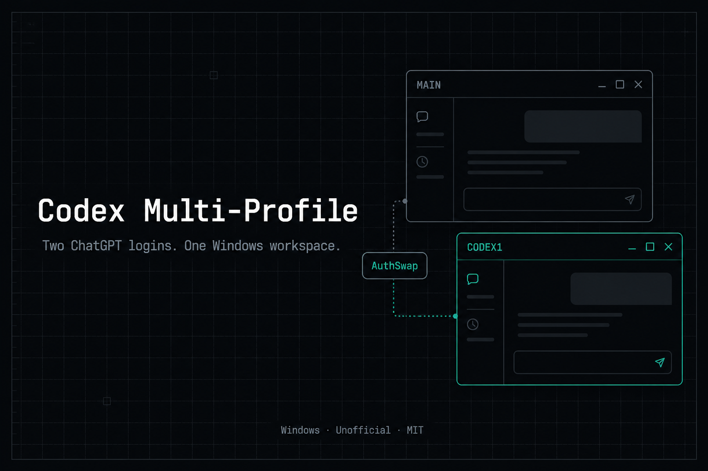
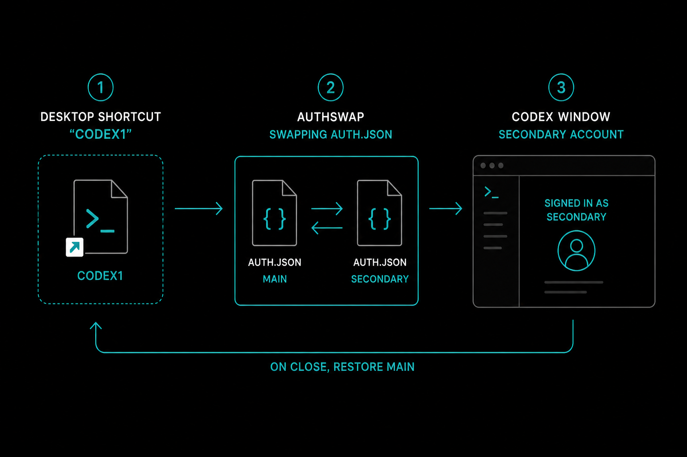

# Codex Multi-Profile

<p align="center">
  <a href="https://github.com/Hung2124/codex-multi-profile/actions/workflows/ci.yml"></a>
  <a href="https://github.com/Hung2124/codex-multi-profile/releases"></a>
  <a href="LICENSE"></a>
  
</p>

<p align="center">
  <strong>Two ChatGPT logins on Codex Desktop for Windows.<br>One shared workspace.</strong>
</p>

<p align="center">
  <a href="README.vi.md">Tiếng Việt</a> ·
  <a href="docs/recipes.md">Recipes</a> ·
  <a href="docs/troubleshooting.md">Troubleshooting</a> ·
  <a href="SUPPORT.md">Support</a>
</p>

<p align="center">
  
</p>

> Unofficial helper. Not affiliated with OpenAI. Needs [Codex Desktop](https://chatgpt.com/codex) from the Microsoft Store.

---

## The problem

A second `CODEX_HOME` often **does not** switch accounts. The Desktop app-server still reads `~\.codex\auth.json`, so you land on the main ChatGPT user.

| You try… | What actually happens |
|:---|:---|
| Copy `~\.codex` + set `CODEX_HOME` | UI still shows the main account |
| `Start-Process` with `$env:CODEX_HOME` | Env is dropped → wrong account |
| Run `ChatGPT.exe` from `WindowsApps` | Access Denied |
| Launch `Codex.exe` | Process exits with code 1 |

**AuthSwap** keeps sessions, skills, MCP, and memories in `~\.codex`. Only `auth.json` moves for the profile window, then restores on close.

<p align="center">
  
</p>

---

## Install

1. Install Codex Desktop and sign in once (**main** account).
2. Close every Codex window.
3. In **Windows PowerShell**:

```powershell
git clone https://github.com/Hung2124/codex-multi-profile.git
cd codex-multi-profile
powershell -NoProfile -ExecutionPolicy Bypass -File .\scripts\Install-CodexMultiProfile.ps1
```

One-liner (zip + same installer):

```powershell
irm https://raw.githubusercontent.com/Hung2124/codex-multi-profile/main/install.ps1 | iex
```

### Desktop shortcuts

| Shortcut | What it does |
|:---|:---|
| **Codex1** | Secondary ChatGPT login (first run asks you to sign in) |
| **Codex Main** | Restore the original account and open Store Codex |
| **Codex Profiles** | List / create another profile |

**Rule:** close one Codex UI before opening the other.

Quick check after install:

```powershell
$m = "$env:LOCALAPPDATA\CodexParallelDesktop\CodexProfile.ps1"
powershell -NoProfile -ExecutionPolicy Bypass -File $m -Action doctor
powershell -NoProfile -ExecutionPolicy Bypass -File $m -Action verify
```

---

## Usage

Set `$root` once, then call the actions you need:

```powershell
$root = "$env:LOCALAPPDATA\CodexParallelDesktop"
$m    = "$root\CodexProfile.ps1"
```

| Goal | Command |
|:---|:---|
| Open secondary account | `...\Launch-CodexProfile.ps1 -Name codex1` |
| Restore main + Store app | `...\Launch-CodexMain.ps1` |
| Create `codex2` | `-Action new -Name codex2` |
| List / status / doctor | `-Action list` · `status` · `doctor` |
| JSON status | `-Action status -AsJson` |
| Running processes | `-Action processes` |
| Verify install | `-Action verify` |
| Remove a profile | `-Action remove -Name codex2 -Force` |
| Safe bug-report log | `...\Redact-LaunchTrace.ps1` |
| Update from git clone | `.\scripts\Update-CodexMultiProfile.ps1` |

Examples:

```powershell
powershell -NoProfile -ExecutionPolicy Bypass -File "$root\Launch-CodexProfile.ps1" -Name codex1
powershell -NoProfile -ExecutionPolicy Bypass -File "$root\Launch-CodexMain.ps1"
powershell -NoProfile -ExecutionPolicy Bypass -File $m -Action doctor
powershell -NoProfile -ExecutionPolicy Bypass -File "$root\Redact-LaunchTrace.ps1"
```

More copy-paste flows: [docs/recipes.md](docs/recipes.md).

Tests (no Codex UI required):

```powershell
powershell -NoProfile -ExecutionPolicy Bypass -File .\tests\Run-All.ps1
```

---

## Agent skill

Install also copies `SKILL.md` to:

- `%USERPROFILE%\.codex\skills\codex-multi-profile\`
- `%USERPROFILE%\.cursor\skills\codex-multi-profile\`

So Codex / Cursor agents know **not** to launch `Codex.exe`, **not** to use `WindowsApps`, and **not** to `Start-Process` without a `.cmd` wrapper.

---

## Safety

| Does | Does not |
|:---|:---|
| Copy `auth.json` **locally** between `~\.codex` and `profiles\<name>` | Upload tokens or set a permanent `CODEX_HOME` |
| Clone `ChatGPT.exe` out of the Store package | Run the Store binary in-place |
| Restore main auth on close; refuse to save if active email == main | Delete `~\.codex` history |

Do not commit `auth.json` or `*.bak`. Prefer `Redact-LaunchTrace.ps1` before pasting logs.

---

## Uninstall

```powershell
powershell -NoProfile -ExecutionPolicy Bypass -File .\scripts\Uninstall-CodexMultiProfile.ps1
# add -PurgeProfiles to also delete local profile auth copies
```

`~\.codex` is never deleted.

---

## Docs

| Doc | Topic |
|:---|:---|
| [Architecture](docs/architecture.md) | Why AuthSwap exists |
| [Troubleshooting](docs/troubleshooting.md) | Wrong account, locks, BOM |
| [FAQ](docs/faq.md) | Common questions |
| [Recipes](docs/recipes.md) | Daily command cards |
| [Support](SUPPORT.md) | Before opening an issue |
| [Changelog](CHANGELOG.md) | Releases |
| [Contributing](CONTRIBUTING.md) | PR rules |
| [Security](SECURITY.md) | Token handling |

## License

[MIT](LICENSE) © Hung Nguyen
