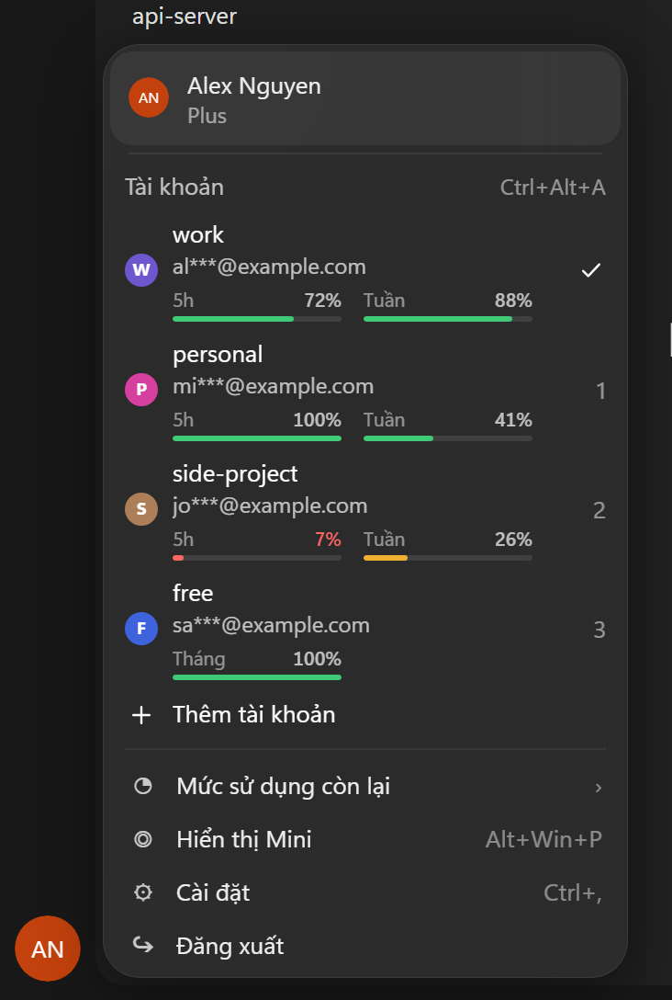

# Codex Multi-Profile

<p align="center">
  <strong>Đổi tài khoản ChatGPT ngay trong menu avatar của Codex (bản Microsoft Store) trên Windows.</strong><br>
  Một app, một không gian làm việc: lịch sử chat, dự án, skill và cài đặt dùng chung.
</p>

<p align="center">
  <a href="README.md">English</a> &middot;
  <a href="docs/architecture.md">Cách hoạt động</a> &middot;
  <a href="docs/troubleshooting.md">Khắc phục sự cố</a>
</p>

<p align="center">
  
</p>

> Công cụ không chính thức, không liên quan OpenAI. Dành cho người có nhiều tài khoản ChatGPT **hợp lệ** của chính mình.
> Không dùng để chia sẻ tài khoản hay lách giới hạn sử dụng.

## Có gì

Bấm avatar ở góc dưới bên trái Codex. Ngay dưới tên bạn có mục **Tài khoản**:

| Trong menu | Tác dụng |
|:---|:---|
| Bấm một tài khoản | Chuyển sang tài khoản đó trong 2-3 giây, cửa sổ Codex giữ nguyên (nếu đang ở màn hình đăng nhập thì Codex khởi động lại, ~10 giây) |
| **Thêm tài khoản** | Codex khởi động lại ở màn hình đăng nhập; đăng nhập tài khoản kia là nó được lưu với tên bạn đặt |
| Bút chì / thùng rác (rê chuột vào dòng) | Đổi tên / xoá tài khoản đã lưu (không xoá được tài khoản đang dùng) |
| Phím `1`-`9` khi menu đang mở | Chọn tài khoản theo số |
| `Ctrl+Alt+A` | Mở menu từ bất kỳ đâu trong Codex |
| Thanh mức sử dụng | Dưới mỗi tài khoản: phần còn lại của các giới hạn (5h và Tuần với gói trả phí, Tháng với gói free), xanh / vàng / đỏ; rê chuột để xem giờ đặt lại. Cập nhật khi mở menu (tối đa 1 lần/phút) |
| Thẻ hết lượt | Khi Codex báo hết giới hạn sử dụng, gợi ý chuyển sang tài khoản kế tiếp |

Menu theo ngôn ngữ của Codex (Việt/Anh) và theo giao diện sáng/tối.

<sub>Ảnh minh hoạ dùng tài khoản giả, được dựng từ chính <code>switcher-inject.js</code> bằng
<code>node tools/screenshots/capture.mjs</code>.</sub>

## Cài đặt

Cần Windows 10/11, [Codex](https://chatgpt.com/codex) từ Microsoft Store, đã đăng nhập một lần.

```powershell
irm https://raw.githubusercontent.com/Hung2124/codex-multi-profile/main/install.ps1 | iex
```

Trình cài đặt lưu tài khoản Codex đang dùng thành `main`, tạo shortcut **Codex** trên Desktop và Start menu, và bật một
trình theo dõi siêu nhẹ chạy cùng Windows (~25 MB, không có cửa sổ). Mở Codex kiểu nào cũng được: từ icon gốc trên
taskbar / Start thì Codex tự khởi động lại một lần trong vài giây đầu để có menu; từ shortcut **Codex** thì có menu ngay
(ghim shortcut này để khỏi phải khởi động lại). `-NoAutoStart` để không dùng trình theo dõi.

Nâng cấp từ bản cũ dùng clone (shortcut Codex1 / Codex Main / Codex Accounts)? Lệnh này nhập các tài khoản
đã lưu, xoá bản cũ và các bản sao `ChatGPT.exe`:

```powershell
$env:CODEX_MP_REMOVE_LEGACY = '1'; irm https://raw.githubusercontent.com/Hung2124/codex-multi-profile/main/install.ps1 | iex
```

## Nên biết

- **Đừng dùng "Đăng xuất" của Codex để đổi tài khoản.** Nó có thể làm hỏng bản đăng nhập đã lưu. Hãy dùng menu.
- Tài khoản có đăng nhập đã hết hạn sẽ hiện màn hình đăng nhập sau khi chuyển. Đăng nhập lại đúng tài khoản đó là
  được lưu tự động. Góc dưới trái vẫn có nút tài khoản nhỏ để chuyển sang tài khoản khác.
- Câu trả lời Codex đang viết dở sẽ dừng khi bạn chuyển tài khoản (đăng nhập thay đổi giữa chừng).
- Trình hỗ trợ menu là một tiến trình PowerShell ẩn, chỉ chạy khi Codex mở (~130 MB, gần như không tốn CPU).

## Dòng lệnh

```powershell
$cli = "$env:LOCALAPPDATA\CodexMultiProfile\CodexAccounts.ps1"
powershell -NoProfile -ExecutionPolicy Bypass -File $cli list      # hoặc: status | save -Name x | switch -Name x | rename -Name x -NewName y | remove -Name x | lang -Name vi
```

## Gỡ cài đặt

```powershell
powershell -NoProfile -ExecutionPolicy Bypass -File "$env:LOCALAPPDATA\CodexMultiProfile\Uninstall-CodexMultiProfile.ps1"   # thêm -RemoveAccounts để xoá các tài khoản đã lưu
```

`~\.codex` (chat, cài đặt, tài khoản đang dùng) không bao giờ bị động tới.

## Riêng tư và bảo mật

- Tài khoản đã lưu chỉ nằm trên máy này ở `%LOCALAPPDATA%\CodexMultiProfile\accounts`. Không gửi đi đâu cả.
- Cửa sổ Codex chỉ nhận email đã che (`ab***@example.com`), không bao giờ nhận token.
- Menu nói chuyện với trình hỗ trợ qua Chrome DevTools protocol chỉ trên `127.0.0.1`. Các chương trình khác chạy
  dưới tài khoản Windows của bạn cũng có thể chạm tới cổng này; nếu điều đó quan trọng với máy bạn thì đừng dùng công cụ này.
- Không sửa file nào của Codex. Xem [docs/architecture.md](docs/architecture.md).
