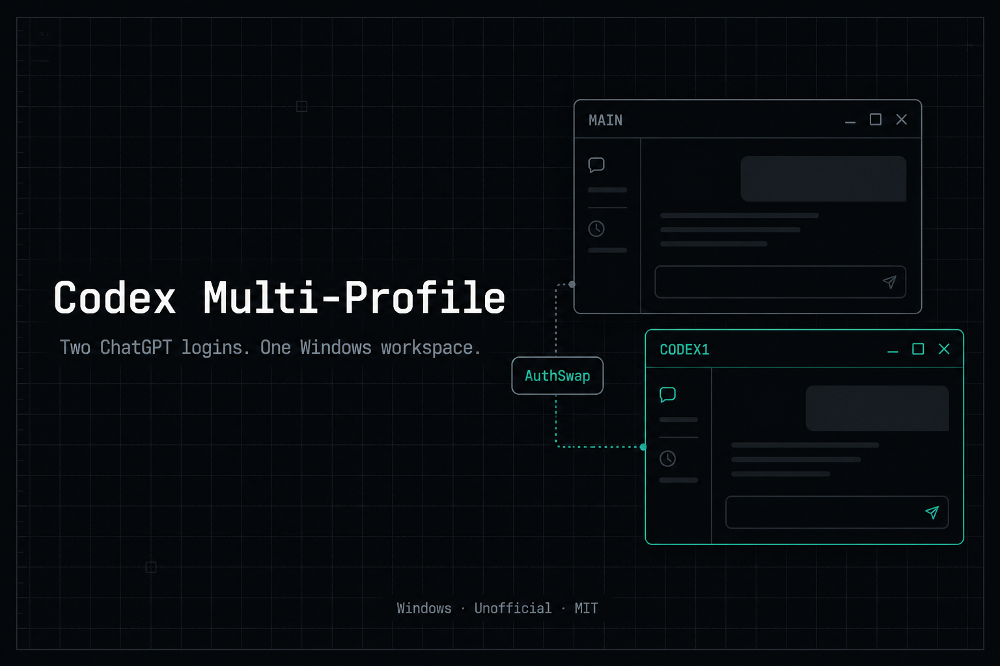
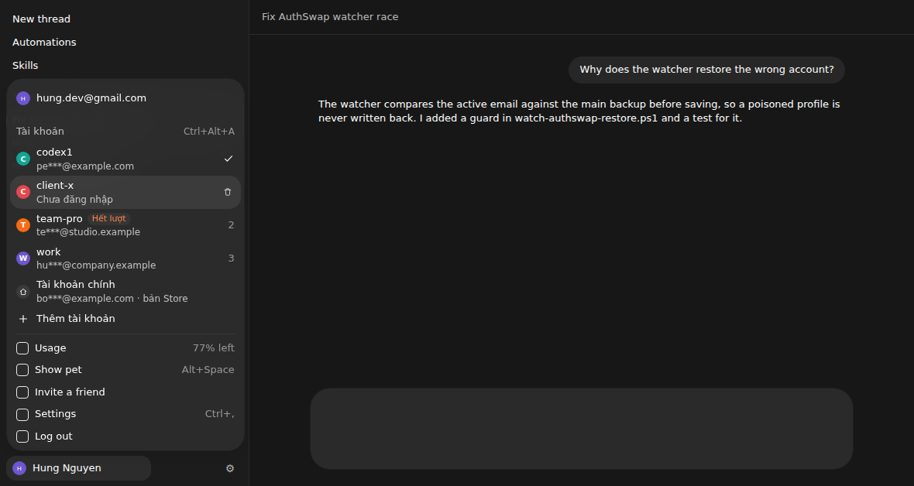
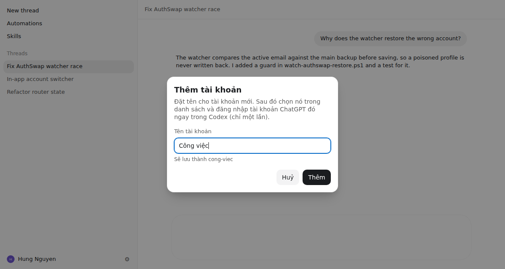

# Codex Multi-Profile

<p align="center">
  <strong>Một app Windows để xem và chọn tài khoản ChatGPT trên Codex Desktop.<br>Một workspace dùng chung. Một cửa sổ (AuthSwap).</strong>
</p>

<p align="center">
  <a href="README.md">English</a> ·
  <a href="docs/in-app-switcher.md">Đổi nick trong Codex</a> ·
  <a href="docs/router.md">Router</a> ·
  <a href="docs/recipes.md">Recipes</a> ·
  <a href="docs/troubleshooting.md">Troubleshooting</a>
</p>

<p align="center">
  
</p>

> Không chính thức, không liên kết OpenAI. Cần [Codex Desktop](https://chatgpt.com/codex) từ Microsoft Store.

## Chọn tài khoản

Sau khi cài, mở **Codex Accounts** trên Desktop. Đó là sản phẩm: danh sách tài khoản (tên, email đã che, lần dùng gần nhất, depleted, sticky). Bấm / Enter để mở profile qua AuthSwap.

Nếu Codex đang mở, app **đóng cửa sổ đó** rồi chuyển sang login đã lưu. Không hỏi mật khẩu khi `auth.json` còn và không bị poison. Đăng nhập lần đầu (profile mới) vẫn nằm trong Codex.

Agent vẫn dùng CLI: `pool` / `stick` / `route` / `depleted`.

## Đổi nick ngay trong Codex (mới ở 0.3.0)

Bật **Trong Codex** trong Codex Accounts (hoặc `CodexProfile.ps1 -Action switcher`). Từ lần mở nick tiếp theo, bấm
**avatar của bạn** ở góc dưới bên trái Codex: ngay dưới tài khoản hiện tại có mục **Tài khoản** liệt kê các nick đã thêm.
**Bấm vào nick nào là đổi sang nick đó** — Codex tự mở lại sau vài giây, lịch sử chat, project, skill, MCP giữ nguyên.

<p align="center">
  
</p>

- Mỗi dòng: tên nick, email đã che, nhãn **Hết lượt**, dấu ✓ ở nick đang dùng. Phím **1–9** khi menu mở = bấm nick có số đó.
- **Thêm tài khoản**: hộp thoại kiểu Codex hỏi tên (gõ tiếng Việt có dấu được, "Công việc" → `cong-viec`). Thêm xong nick mới
  hiện ngay trong danh sách, bấm **Đăng nhập ngay** để đăng nhập tài khoản đó trong Codex (một lần).
- **Xoá**: rê chuột vào một dòng → biểu tượng thùng rác → xác nhận. Chỉ xoá đăng nhập đã lưu của nick đó, không đụng lịch sử chat.
  Không xoá được nick đang dùng.
- **Ctrl+Alt+A** mở menu avatar từ bất cứ đâu. Khi Codex báo "You've hit your usage limit", có thẻ gợi ý chuyển sang nick còn lượt (chỉ gợi ý).
- Giao diện dùng đúng thông số menu Codex bản mới (bo góc, màu, cỡ chữ), theo sáng/tối của Codex; tiếng Việt/Anh theo hệ thống (`-Lang vi` để ép tiếng Việt).

<p align="center">
  
</p>

Tuỳ chọn (tắt mặc định), chỉ chạy trên bản clone ChatGPT.exe, qua DevTools loopback 127.0.0.1, không vá `app.asar` / ChatGPT.exe,
không mở server mạng. Chi tiết và lưu ý bảo mật: [docs/in-app-switcher.md](docs/in-app-switcher.md).

```powershell
# Cài và bật luôn nút đổi nick trong Codex
$env:CODEX_MP_INAPP = '1'; irm https://raw.githubusercontent.com/Hung2124/codex-multi-profile/main/install.ps1 | iex

# Bật / tắt sau khi cài
$m = "$env:LOCALAPPDATA\CodexParallelDesktop\CodexProfile.ps1"
powershell -NoProfile -ExecutionPolicy Bypass -File $m -Action switcher -Lang vi
powershell -NoProfile -ExecutionPolicy Bypass -File $m -Action switcher -Disable
```

Vì sao Codex phải mở lại: app-server của Codex đọc token lúc khởi động, đổi `auth.json` khi đang chạy dễ ra cảnh UI một nick
còn request một nick. Mở lại bản clone (AuthSwap một cửa sổ) là cách chắc chắn.

## Cài (một lệnh)

```powershell
irm https://raw.githubusercontent.com/Hung2124/codex-multi-profile/main/install.ps1 | iex
```

Giống one-liner curl|bash của b-nnett/codex-subscription-router — không vá ChatGPT.exe.

1. Cài Codex Desktop, đăng nhập acc chính một lần, rồi đóng app.
2. Chạy lệnh trên.
3. Shortcut **Codex Accounts** (chính) / Codex1 / Codex Main / Codex Profiles.

## Router

**Người dùng:** mở **Codex Accounts**. **Agent:** `CodexProfile.ps1 -Action route`.

Bảng định tuyến kiểu subscription-router, vẫn một cửa sổ vì AuthSwap chỉ có một ~/.codex/auth.json. Chi tiết: [docs/router.md](docs/router.md).

| Tình huống | Cách xử lý |
|:---|:---|
| Chat / folder mới | Profile non-depleted dùng lâu nhất (LRU) |
| Cùng git repo / workspace | Sticky owner |
| Owner bị đánh dấu depleted | Failover sang profile còn lại |
| Tất cả depleted | Một thông báo gộp (email đã che). Không mở app |
| Đang mở một cửa sổ Codex | App đóng clone rồi chuyển acc. CLI `route` chỉ in lựa chọn |

```powershell
$m = "$env:LOCALAPPDATA\CodexParallelDesktop\CodexProfile.ps1"
powershell -NoProfile -ExecutionPolicy Bypass -File $m -Action pool
powershell -NoProfile -ExecutionPolicy Bypass -File $m -Action stick -Name codex1
powershell -NoProfile -ExecutionPolicy Bypass -File $m -Action route
```

Chỉ dùng tài khoản bạn sở hữu / được phép. depleted là cờ local — không phải công cụ vượt quota.

## Mục đích & sử dụng hợp lệ

Repo này là công cụ mã nguồn mở, chạy local trên Windows dành cho developer đã có nhiều tài khoản ChatGPT hợp lệ (ví dụ cá nhân và công ty).

Repo không nhắm tới chia sẻ gói trả phí, vượt quota, scrape, API không chính thức, hoặc trái Điều khoản OpenAI.

## AuthSwap

CODEX_HOME thứ hai thường không đổi acc — app vẫn đọc ~/.codex/auth.json. AuthSwap chép token acc phụ vào đúng file app đọc; lúc đóng thì restore acc chính.

Nút đổi nick trong Codex, layer và model ChatGPT Web đều tắt mặc định (-Action switcher / -Action layer / -Action models).

## Gỡ

```powershell
powershell -NoProfile -ExecutionPolicy Bypass -File .\scripts\Uninstall-CodexMultiProfile.ps1
```

Không xóa ~/.codex.

## Tài liệu

- [Đổi nick trong Codex](docs/in-app-switcher.md)
- [Router](docs/router.md)
- [Architecture](docs/architecture.md)
- [Troubleshooting](docs/troubleshooting.md)
- [FAQ](docs/faq.md)
- [Recipes](docs/recipes.md)
- [Changelog](CHANGELOG.md)
