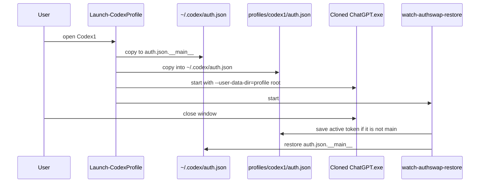

# Architecture

## Problem

Codex Desktop on Windows stores ChatGPT auth at:

```
%USERPROFILE%\.codex\auth.json
```

People try a second profile with `CODEX_HOME=...\profiles\codex1\.codex`. That often fails: the Electron app-server still reads `~\.codex\auth.json`, so the window shows the **main** account. Owl logs may also show `Ignoring late userData path change` if `CODEX_ELECTRON_USER_DATA_PATH` ≠ `--user-data-dir`.

## AuthSwap

Keep **one** real Codex home (`~\.codex`) for data. Only the token file moves.



## Process rules

1. **Clone, don't run Store in-place.** `WindowsApps\...\ChatGPT.exe` is Access Denied. Copy the `app` folder to `%LOCALAPPDATA%\CodexParallelDesktop\versions\<ver>\app`.
2. **Launch via `.cmd`.** `Start-Process` / `UseShellExecute` often drops `CODEX_HOME`. The launcher writes `launch-<name>-env.cmd` with `set` lines, then `start`s it.
3. **Same path for UI data.** `CODEX_ELECTRON_USER_DATA_PATH` and `--user-data-dir` are both the profile root.
4. **UTF-8 without BOM** for anything Codex parses (`config.toml`). Windows PowerShell 5.1 `Set-Content -Encoding UTF8` writes a BOM.

## Files

| Script | Role |
|---|---|
| `Install-CodexMultiProfile.ps1` | Copy launchers, clone app, Desktop shortcuts, install skill |
| `Launch-CodexProfile.ps1` | AuthSwap in + start clone |
| `watch-authswap-restore.ps1` | AuthSwap out on close |
| `Launch-CodexMain.ps1` | Save secondary if needed, restore main, start Store app |
| `CodexProfile.ps1` | `new` / `list` / `stop` / `sync` / `share` |

## What is never shared

`auth.json` is per profile. Junctions (ShareLive) cover `sessions`, `skills`, `memories`, `plugins`, `vendor_imports`, `sqlite`. Database files used as session index are copied, not junctioned, to avoid two writers on one SQLite WAL.
